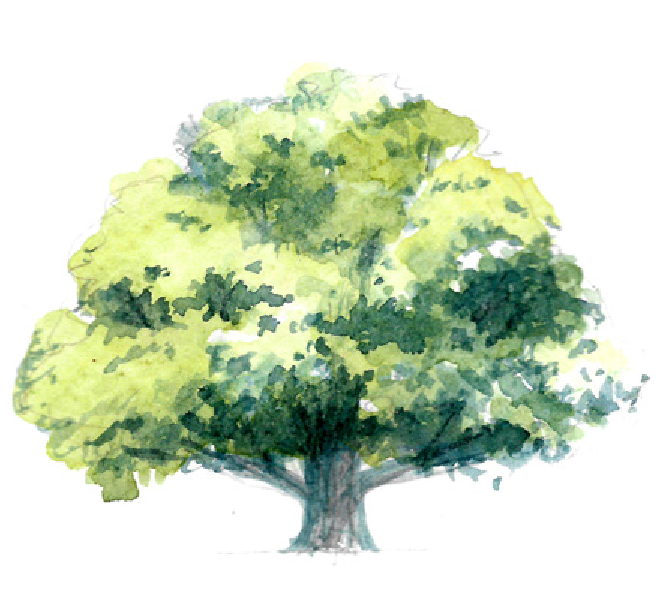

# WEEK 10

## This Week’s Focus



We will close on the book of Ezra and embark on the post-Davidic history of Israel, beginning with Solomon. Understanding this history will provide us with a greater appreciation of the events in the books of Nehemiah and Ezra. Our first pit stop is the book of Ecclesiastes. The phrase, “Vanity, vanity…” will echo throughout the book as Solomon challenges us on how everything in this life and in this world is meaningless apart from a relationship with God. As you read through Solomon’s words, may it rouse you to live a God-centred life and may you always remember that this world is not your home\!

<u>NOTE</u>: We recommend you watch “Overview – Ecclesiastes” in the Additional Resources before you start reading the book of Ecclesiastes.

## Monday

```
“Rise up; this matter is in your hands. We will support you, so take courage and do it.” – Ezra 10:4 (NIV)
```


### Today’s Meditation

1. Read [Ezra 10](https://www.biblegateway.com/passage/?search=ezra+10&version=ESV)

### Reflection Questions

1. In completing a task God has called you to do, how important is the support of others (v 4) to you?

2. What did you observe from the way Ezra dealt with the issue of improper marriages?

### Speak, Lord... Your Servant is Listening

1. Areas of my life (character, lifestyle and values) the Holy Spirit is prompting me to adjust.

2. Any other promptings from the Holy Spirit? (Words of encouragement, specific actions, etc.)

## Tuesday

```
“For when Solomon was old his wives turned away his heart after other gods, and his heart was not wholly true to the Lord his God, as was the heart of David his father.” – 1 Kings 11:4 (ESV)
```


### Today’s Meditation

1. Read [1 Kings 11](https://www.biblegateway.com/passage/?search=1+kings+11&version=ESV)

### Reflection Questions

1. Solomon was given a wise and understanding heart, like none other from the Lord. Yet, he ended up forsaking the Lord and His ways. How did that slow fade happened? (v 1-2)

2. Do an honest search of your heart - what is turning or has turned your heart away from being fully devoted to God? What action(s) can you take to remove any of these things from your life?

### Speak, Lord... Your Servant is Listening

1. Areas of my life (character, lifestyle and values) the Holy Spirit is prompting me to adjust.

2. Any other promptings from the Holy Spirit? (Words of encouragement, specific actions, etc.)

## Wednesday

```
“I have seen everything that is done under the sun, and behold, all is vanity and a striving after wind.” – Ecclesiastes 1:14 (ESV)
```


### Today’s Meditation

1. Read [Ecclesiastes 1](https://www.biblegateway.com/passage/?search=Ecclesiastes+1&version=ESV)

### Reflection Questions

1. Why would the conclusion that “everything is meaningless” be made by the wisest man that ever lived?

2. If this is true for Solomon, is it true for us as New Testament believers? Why or why not?

### Speak, Lord... Your Servant is Listening

1. Areas of my life (character, lifestyle and values) the Holy Spirit is prompting me to adjust.

2. Any other promptings from the Holy Spirit? (Words of encouragement, specific actions, etc.)

## Thursday

```
“Then I saw that there is more gain in wisdom than in folly, as there is more gain in light than in darkness. The wise person has his eyes in his head, but the fool walks in darkness. And yet I perceived that the same event happens to all of them.” – Ecclesiastes 2:13-14 (ESV)
```


### Today’s Meditation

1. Read [Ecclesiastes 2](https://www.biblegateway.com/passage/?search=Ecclesiastes+2&version=ESV)

### Reflection Questions

1. Solomon wrote that pleasure, wisdom and folly, and toil are all meaningless. Evaluate each of these – why can they be meaningless?

2. Reflect on vv 17-23. How then should we as Christians approach our work? (Refer also to [Colossians 3:23](https://www.biblegateway.com/passage/?search=Colossians+3%3A23&version=ESV), [John 6:27](https://www.biblegateway.com/passage/?search=John+6%3A27&version=ESV), [1 Timothy](https://www.biblegateway.com/passage/?search=1+Timothy+5%3A8&version=ESV) [5:8](https://www.biblegateway.com/passage/?search=1+Timothy+5%3A8&version=ESV))

### Speak, Lord... Your Servant is Listening

1. Areas of my life (character, lifestyle and values) the Holy Spirit is prompting me to adjust.

2. Any other promptings from the Holy Spirit? (Words of encouragement, specific actions, etc.)

## FRIDAY

```
“I perceived that whatever God does endures forever; nothing can be added to it, nor anything taken from it. God has done it, so that people fear before him.” – Ecclesiastes 3:14 (ESV)
```


### Today’s Meditation

1. Read [Ecclesiastes 3](https://www.biblegateway.com/passage/?search=Ecclesiastes+3&version=ESV)

### Reflection Questions

1. In the Hebrew language, verses 2-8 was intentionally written poetically to show the monotony of all things, rather than their variety (a time… a time… a time…). It reminds us of the inevitability of trouble and evil, and of the relentless monotony of life. As Christ followers, what then should our posture be in light of the inevitability of trouble and evil?

2. Verse 11 says that God “has also set eternity in the human heart”. What does that mean for you in this transient world? How can we live with an eternal perspective?

### Speak, Lord... Your Servant is Listening

1. Areas of my life (character, lifestyle and values) the Holy Spirit is prompting me to adjust.

2. Any other promptings from the Holy Spirit? (Words of encouragement, specific actions, etc.)

June 27

## Saturday

```
“But woe to him who is alone when he falls and has not another to lift him up\!” - Ecclesiastes 4:10 (ESV)
```


### Today’s Meditation

1. Read [Ecclesiastes 4](https://www.biblegateway.com/passage/?search=Ecclesiastes+4&version=ESV)

### Reflection Questions

1. Amidst Solomon’s lament of the vanity in various aspects of life, he takes a rare turn and praises one aspect of life that is worth investing in – relationships. Why is investing in an intimate spiritual friendship so important for one’s life?

2. “…a threefold cord is not quickly broken” (v 12). Identify two relationships that you would like to invest in. How can you keep this relationship God-centred? How can you spur each other to grow in your faith?

### Speak, Lord... Your Servant is Listening

1. Areas of my life (character, lifestyle and values) the Holy Spirit is prompting me to adjust.

2. Any other promptings from the Holy Spirit? (Words of encouragement, specific actions, etc.)

## Sunday

```
“He who loves money will not be satisfied with money, nor he who loves wealth with his income; this also is vanity.” - Ecclesiastes 5:10 (ESV)
```


### Today’s Meditation

1. Read [Ecclesiastes 5-6](https://www.biblegateway.com/passage/?search=Ecclesiastes+5-6&version=ESV)

### Reflection Questions

1. “All the toil of man is for his mouth, yet his appetite is not satisfied.” (v 6:7) In chapters 5-6 Solomon deals with the vanity of wealth and materialism. What are some reasons he gives for the vanity of wealth and materialism?

2. In view of Solomon’s reflection on money, how then should we live as Christians? What is the right posture for us to have towards wealth and abundance? (Refer to [Hebrews 13:5](https://www.biblegateway.com/passage/?search=Hebrews+13%3A5&version=ESV), [Matthew 6:19-21](https://www.biblegateway.com/passage/?search=Matthew+6%3A19-21&version=ESV), [1 Timothy 6:17](https://www.biblegateway.com/passage/?search=1+Timothy+6%3A17&version=ESV), [1 John 3:17](https://www.biblegateway.com/passage/?search=1+John+3%3A17&version=ESV))

### Speak, Lord... Your Servant is Listening

1. Areas of my life (character, lifestyle and values) the Holy Spirit is prompting me to adjust.

2. Any other promptings from the Holy Spirit? (Words of encouragement, specific actions, etc.)

## Additional Resources


- [Video: Overview - Ecclesiastes by The Bible Project](https://www.youtube.com/watch?v=lrsQ1tc-2wk)

- [Podcast: The Importance of Friendship by Kelly Needham, Family Life Today](https://rlc.sg/ImportanceOfFriendship)

- [Article: Give Beyond Your Leftovers by Christy Britton, Revive our Hearts](https://rlc.sg/30UcdgY)

- [Article: Wealth and Following Jesus by Aaron Devine](https://rlc.sg/3edHS0r))

- [Article: 5 Reasons Why Our Work Matters to God by Daniel Darling](https://rlc.sg/3fsrIAG))

- [Song: Reward by Josh Yeoh](https://www.youtube.com/watch?v=fhkdfnNeWag)
