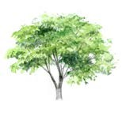

# Week 2

## This Week’s Focus


This week, we continue to expore the theme of sin and brokenness, but in the light of what Christ has done for us. We will then pick up from where we left off in Nehemiah - the surveying of the wall and the rebuilding in the midst of opposition.

## Monday

```
“He who has ears to hear, let him hear.” - Mark 4:9 (ESV)
```


### Today’s Meditation

1. Read [Mark 4:1-15](https://www.biblegateway.com/passage/?search=Mark+4%3A1-15&version=ESV)

### Reflection Questions

1. What are the characteristics of a life that does not live according to the Word (vs. 3-7)?

2. What is one attitude towards the commands of God (obedience) that you will need to adjust?

### Speak, Lord... Your Servant is Listening

1. Areas of my life (character, lifestyle and values) the Holy Spirit is prompting me to adjust.

2. Any other promptings from the Holy Spirit? (Words of encouragement, specific actions, etc.)

## Tuesday

```
“Those who are well have no need of a physician, but those who are sick.” - Luke 5:31 (ESV)
```


### Today’s Meditation

1. Read [Luke 5:27-32](https://www.biblegateway.com/passage/?search=Luke+5%3A27-32&version=ESV)
2. Read [Luke 7:36-50](https://www.biblegateway.com/passage/?search=Luke+7%3A36-50&version=ESV)

### Reflection Questions

1. True forgiveness of sins require genuine acknowledgment of one’s sins. Take some time to examine your life and to know your true state before God.

2. What does the forgiveness of sins mean to you? Contrast your posture towards God’s forgiveness with that of the sinful woman.

### Speak, Lord... Your Servant is Listening

1. Areas of my life (character, lifestyle and values) the Holy Spirit is prompting me to adjust.

2. Any other promptings from the Holy Spirit? (Words of encouragement, specific actions, etc.)

## Wednesday

```
“But if anyone does sin, we have an advocate with the Father, Jesus Christ the righteous.” - 1 John 2:1 (ESV)
```


### Today’s Meditation

1. Read [1 John 1:5-2:2](https://www.biblegateway.com/passage/?search=1+John+1%3A5-2%3A2&version=ESV)

### Reflection Questions

1. According to this passage, what happens when we confess our sins to God? What is the right posture for you to have in a genuine confession of sin?

2. What does it mean that Jesus is the “propitiation for our sins”? What are the implications when we approach God in prayer?

### Speak, Lord... Your Servant is Listening

1. Areas of my life (character, lifestyle and values) the Holy Spirit is prompting me to adjust.

2. Any other promptings from the Holy Spirit? (Words of encouragement, specific actions, etc.)

## Thursday

```
“Whoever says “I know Him” but does not keep His commandments is a liar, and the truth is not in him...” - 1 John 2:4 (ESV)
```


### Today’s Meditation

1. Read [1 John 2:3-29](https://www.biblegateway.com/passage/?search=1+John+2%3A3-29&version=ESV)

### Reflection Questions

1. “Whoever says he is in the light and hates his brother is still in darkness.” Are there fellow believers in your life that you find difficult to love? How then can you “be in the light” in these relationships?

2. Examine your life in the light of this passage. Are there any areas in your life that exhibit a love for the world (vs. 15-16)?

### Speak, Lord... Your Servant is Listening

1. Areas of my life (character, lifestyle and values) the Holy Spirit is prompting me to adjust.

2. Any other promptings from the Holy Spirit? (Words of encouragement, specific actions, etc.)

## FRIDAY

```
“The God of heaven will make us prosper, and we his servants will arise and build...” - Nehemiah 2:20 (ESV)
```


### Today’s Meditation

1. Read [Nehemiah 2](https://www.biblegateway.com/passage/?search=Nehemiah+2&version=ESV)

### Reflection Questions

1. Why do you think it was important that Nehemiah surveyed the walls first before rebuilding? Why do you think he surveyed it alone?

2. “Come, let us build the wall of Jerusalem, that we may no longer suffer derision.” We have been dealing with the theme of sin and brokenness. Ultimately, what is the reason for you to live a life of obedience?

### Speak, Lord... Your Servant is Listening

1. Areas of my life (character, lifestyle and values) the Holy Spirit is prompting me to adjust.

2. Any other promptings from the Holy Spirit? (Words of encouragement, specific actions, etc.)

## Saturday

```
“Then Eliashib the high priest rose up with his brothers the priests, and they built the Sheep Gate.” - Nehemiah 3:1 (ESV)
```


### Today’s Meditation

1. Read [Nehemiah 3](https://www.bibleghttps://www.biblegateway.com/passage/?search=Nehemiah+3&version=ESVateway.com/passage/?search=psalm+51&version=ESV)

### Reflection Questions

1. Nehemiah 3 has a long list of people that contributed to the rebuilding of the walls. What does it tell you about the role your spiritual community plays in your life?

2. Name 2 - 3 people that you would ask to intentionally help you “fortify your walls”. Practically, what can they do to help you?

### Speak, Lord... Your Servant is Listening

1. Areas of my life (character, lifestyle and values) the Holy Spirit is prompting me to adjust.

2. Any other promptings from the Holy Spirit? (Words of encouragement, specific actions, etc.)

## Sunday

```
“And they all plotted together to come and fight against Jerusalem and to cause confusion in it.” - Nehemiah 4:8 (ESV)
```


### Today’s Meditation

1. Read [Nehemiah 4](https://www.biblegateway.com/passage/?search=Nehemiah+4&version=ESV)

### Reflection Questions

1. Opposition is to be expected when we want to “fortify the walls of our lives.” What kind of opposition do you think you will face or are currently facing? (eg. temptations, lifestyle, sinful acts, discouragements, etc.)

2. “Hear, O our God, for we are despised.” How can you deal with your oppositions in a God-honouring way?

### Speak, Lord... Your Servant is Listening

1. Areas of my life (character, lifestyle and values) the Holy Spirit is prompting me to adjust.

2. Any other promptings from the Holy Spirit? (Words of encouragement, specific actions, etc.)

## Additional Resources



- [Video: Testimony of Li Nanxing by Celebration of Hope](https://www.youtube.com/watch?v=zzwxUl3pKlI)

- [Article: Confronting the Error of Hyper-Grace by Dr. Michael Brown](https://bit.ly/2KwT0sg)

- [Article: 4 Surprising Ways a Believer Can be Self-Deceived by Jennifer Waddle](https://bit.ly/3aFiTAR)

- [Article: The Devil Cannot Condemn You by Olan Stubbs](https://bit.ly/2yAmt1D)

- [Song: Clean by Natalie Grant](https://www.youtube.com/watch?v=dqfgjSPMcnc)
